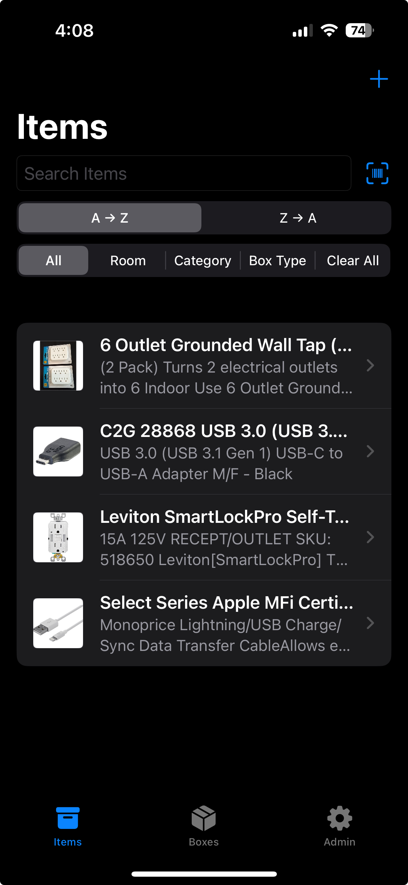
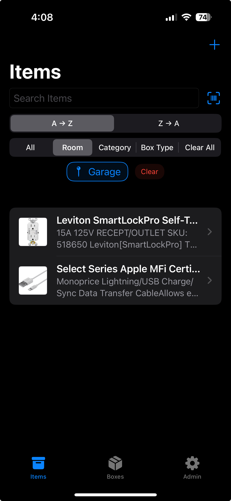
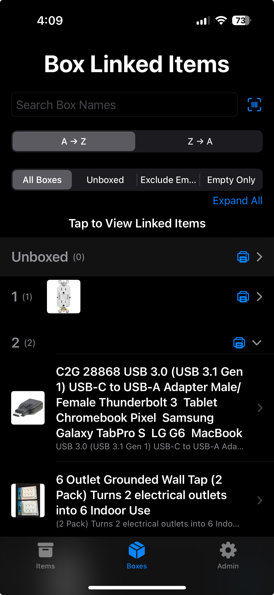
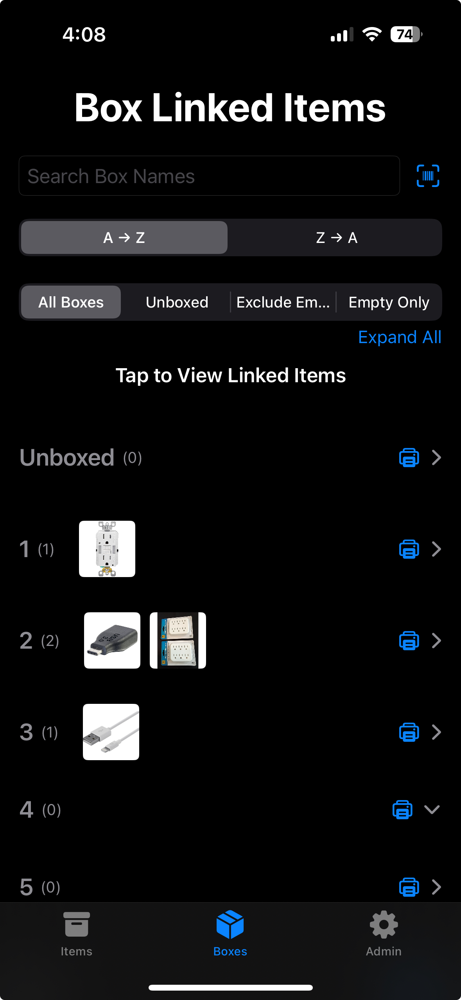
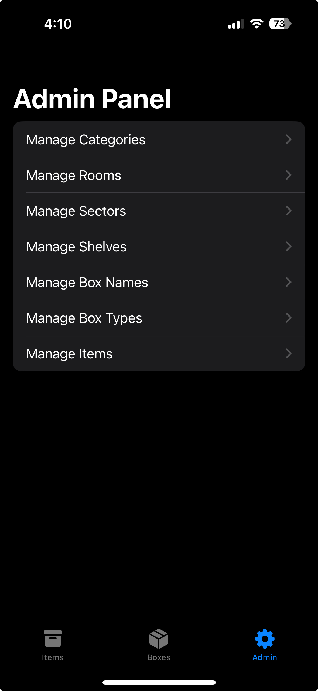
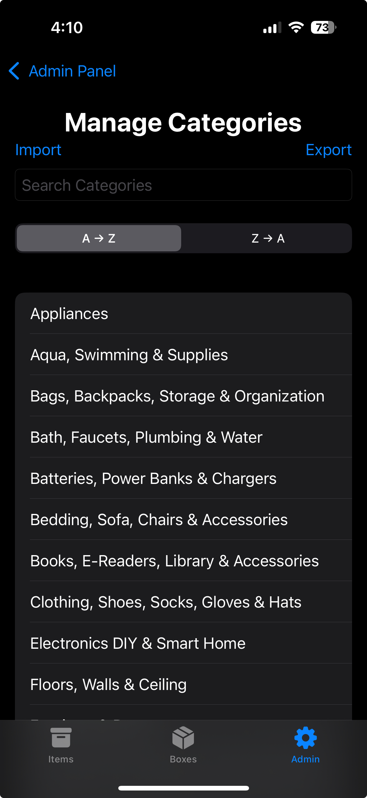
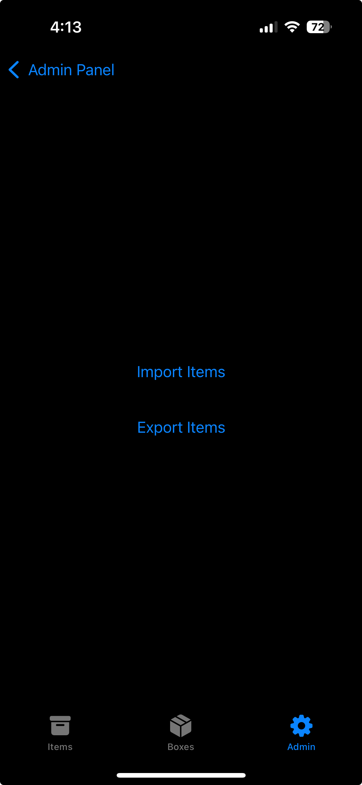

# 📦 itemserv

**ItemServ** is a powerful SwiftUI-based iOS/iPadOS app to organize and track storage items and boxes — with CloudKit sync, barcode scanning, label printing, and import/export support.


---

## 🚀 Features

- 📂 **Flexible Hierarchy**: Organize items by Room → Sector → Shelf → Box → Item.
- 🗃️ **Custom Box Metadata**: Box names and types (e.g., plastic, cardboard, wood).
- 🖼️ **Image Attachments**: Add photos to any item.
- 🔍 **Advanced Filtering**: Filter by room, sector, box, type, or category.
- 📦 **Unboxed Items**: Track items not assigned to any box.
- 📤 **Import/Export**: Backup and restore via `.zip` (JSON + images).
- 🖨️ **Label Printing**: Supports Brother QL-1110NWBC.
  - Box labels: DK-1202 (2.4x4")
  - Item labels: DK-2205 (2.4x1.5") or DK-1204 (0.66x2.1")
- 📷 **Barcode Scanning**:
  - **Item Lookup**: Auto-fill item name, description, and image from public barcode DBs.
  - **Box & Item Search**: Instantly locate by scanning a printed barcode.
- 👤 **Admin Panel**: Manage Rooms, Sectors, Shelves, Box Names, Types, and Categories.
- ✅ **Production-tested**: Used daily to manage a real household inventory of 800+ items.
- 🚀 **Distributed via TestFlight** with bug tracking and iterative improvements.

### 🧠 Smart Sorting & Status Features
#### 🔽 Sort by Recently Added or Modified (Default)
- Items are automatically sorted by most recently **added or edited**
- Options:
  - **Recent** (default): latest added or updated
  - **A → Z**, **Z → A**: alphabetical sorting
- This helps you quickly find what’s new or recently changed
#### 👁️ Info / Compact Status Toggle
- A **“Status” toggle button** appears next to sort options
- Modes:
  - **Info**: shows 🆕 or ✏️ badges with how long ago it was added/updated (e.g. `✏️ 3h ago`)
  - **Compact**: hides status for a cleaner view (default)
#### 📄 Detail View with Added/Modified Indicator
- Every item detail view shows a subtle status:
  - `🆕 2d ago` — newly added
  - `✏️ 4h ago` — recently updated
- Time is shown using smart compact units: `s`, `m`, `h`, `d`, `mo`, `y`
✅ These features give you high visibility into your inventory activity, while keeping the interface clean and efficient.

---

## 📱 Requirements

- iOS/iPadOS 17+
- Swift 5.9+
- Xcode 15+
- iCloud enabled (for CloudKit private sync)

---

## 🛠️ Technologies Used

- **SwiftUI** – Declarative UI
- **SwiftData** – Persistence & relationships
- **CloudKit** – Syncing and storage
- **CoreImage & AVFoundation** – Barcode scanning
- **UIKit bridge** – For camera and image picker

---

## 📦 Project Structure

```
itemserv/
├── Models/         # SwiftData models (Item, Room, BoxType, etc.)
├── Views/          # SwiftUI views for user and admin flows
├── ExportImport/   # Zip backup/restore logic
├── Helpers/        # Utilities: printing, barcodes, images
```

---

## 🔐 iCloud / Privacy

All data is stored locally and optionally synced to your private iCloud database.  
**No external servers, tracking, or analytics.**

---

## 💡 Roadmap

- [ ] Tag-based categorization and smart folders
- [ ] CloudKit sharing for multi-user home access
- [ ] AI-based item recognition (on-device CoreML)
- [ ] Additional printer model support

---

## 📸 Screenshots

| View | Screenshot |
|------|------------|
| Main Items View |  |
| Filter by Room |  |
| Box (Expanded) |  |
| Box (Collapsed) |  |
| Admin Panel |  |
| Category Management |  |
| Import/Export |  |

---

## 👨‍💻 Author

Developed by **tonyolyva**  
GitHub: [github.com/tonyolyva](https://github.com/tonyolyva)

---

## 📃 License

MIT License – See [`LICENSE`](LICENSE) for details.

---

## 📄 Portfolio

- 🔗 [Anatoliy Olyva Portfolio](https://tonyolyva.carrd.co)
- 🔗 [CalculMath – iOS Calculator App](https://github.com/tonyolyva/CalculMath)
